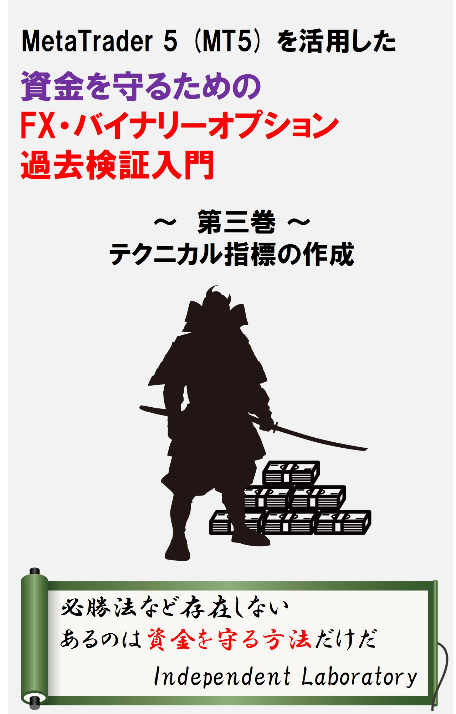

# MetaTrader 5 (MT5) を活用した資金を守るためのFX・バイナリーオプション過去検証入門シリーズ  第三巻　テクニカル指標の作成　サポートページ

本Webページでは、書籍「MetaTrader 5 (MT5) を活用した資金を守るためのFX・バイナリーオプション過去検証入門　～第三巻～
テクニカル指標の作成」の付録を配布しています。

ご利用はご自身の責任の下でお願いいたします。
